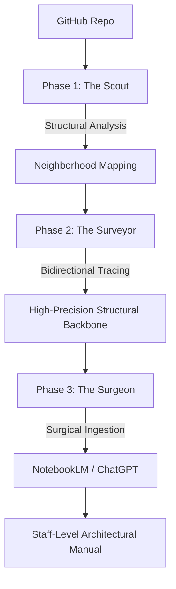

# RepoOrbit: The Developer Exoskeleton

RepoOrbit is a **High-Precision AI Orchestration Pipeline** designed for senior engineers auditing massive, complex codebases. It uses a deterministic, three-stage discovery loop to eliminate hallucinations and solve the "Context Limit" problem through surgical structural mapping.

---

## 📐 The Engine Architecture



---

## ⚙️ The Three-Stage Discovery Loop

1.  **🔭 The Scout (Planner)**: Performs high-level mapping (Package maps, `tsconfig`, `go.mod`) to identify relevant "Neighborhoods" and filter out 90% of repository noise.
2.  **📐 The Surveyor (Architect)**: Maps bidirectional execution traces and populates the **High-Precision Structural Backbone** (`graph.json`, `symbols.json`) for deterministic symbol lookup.
3.  **🔪 The Surgeon (Coder)**: Feeds surgical code blocks to **DeepSeek** or **ChatGPT**. Enriched with structural metadata (consumers, hubs, authority), it generates high-fidelity architectural briefings.

---

## 🚀 Key Breakthroughs

- **🏗️ Structural Backbone**: Maps every import, consumer, and symbol definition. Dramatically reduces context saturation for downstream AI calls.
- **👑 Global Symbol Authority**: A deterministic audit layer that maps class/function definitions to their source of truth, preventing generative hallucinations.
- **📐 ChatGPT Architectural Synthesis**: Uses a **Staff-Level Systems Engineer** persona to transform raw structural JSON into a coherent, high-level mental model of the system.
- **🌉 NotebookLM Automation**: Leverages Playwright to automate "Expert Context" ingestion via the Chrome DevTools Protocol (CDP).

---

## 🛠️ Tech Stack

- **Automation**: Playwright (CDP-based Browser Orchestration)
- **Framework**: Next.js 16 (App Router)
- **Engine**: Bidirectional Graph Mapping + Global Symbol Indexing
- **LLM Pipeline**: 
    - **ChatGPT**: Staff-Level Architectural Synthesis & Manual Generation.
    - **DeepSeek V3**: Specialized Implementation Analysis & Logic Auditing.
- **Styling**: Tailwind CSS v4 (Glassmorphism Engineering Aesthetics)

---

## 🏁 Quick Start

```bash
git clone https://github.com/jaadu611/repoorbit
npm install
npm run dev
```

**Environment Variables (.env)**:
- `GITHUB_TOKEN`
- `DEEPSEEK_API_KEY`

---
*Built for engineers who need to see through the noise.*
