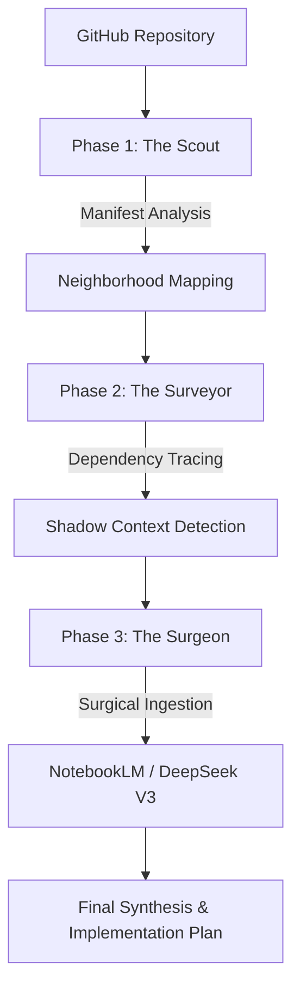

# RepoOrbit: The Developer Exoskeleton

RepoOrbit is a **High-Precision AI Orchestration Pipeline** and **Context Exoskeleton** designed for senior engineers auditing massive, complex codebases. Unlike traditional "generative" tools that guess at repository structures, RepoOrbit uses a deterministic, three-stage discovery loop to eliminate hallucinations and solve the "Context Limit" problem.

## 🛰️ The Core Philosophy: Deterministic Mapping over Generative Guessing

Modern LLMs struggle with "lost in the middle" and context saturation. RepoOrbit rejects the brute-force approach of dumping entire directories into a prompt. Instead, it follows the **"Narrow Path"** approach to context loading: 
- **Identify** the exact required files through graph-based dependency analysis.
- **Prune** noise (build artifacts, vendor code, irrelevant types).
- **Surface** "Missing Links"—dependencies called in code but not yet implemented or indexed.

---

## 📐 The Engine Architecture



---

## ⚙️ The Three-Stage Engine

### 🔭 Phase 1: The Planner (The Scout)
The engine performs a high-level manifest analysis (Package maps, `tsconfig`, `go.mod`, `Cargo.toml`) to identify the "Neighborhoods" relevant to your query. It ignores the 90% of the codebase that doesn't touch the execution path, reducing noise before the first AI call is ever made.

### 📐 Phase 2: The Architect (The Surveyor)
Using the Planner's findings, the Architect maps execution traces and identifies "Shadow" dependencies. This phase is critical for finding **Missing Links**—detecting references to unimplemented or external code and flagging them as architectural anomalies before they cause hallucinations in the synthesis phase.

### 🔪 Phase 3: The Surgeon (The Coder)
The final stage feeds surgical, high-density code blocks to DeepSeek or Gemini. By providing 100% accurate, importance-weighted context, the Surgeon generates zero-hallucination architectural briefings and implementation plans that are ready for senior-level review.

---

## 🚀 Key Technical Breakthroughs

### 👻 The Proximity Protocol (Shadow Context)
A graph-traversal algorithm that automatically pulls "Shadow" files—relevant types, constants, and neighbor components—even if they reside outside the main file's directory. This ensures the LLM always has the required structural context to understand a single file's logic.

### 🛡️ The Hallucination Firewall
A deterministic audit layer that detects references to symbols not present in the indexed manifest. This prevents AI from "inventing" implementation details for external or planned but unimplemented code.

### 🌉 NotebookLM CDP Bridge
RepoOrbit leverages Playwright to automate the Gemini 1.5 Pro "Expert Context" within NotebookLM. By connecting via the Chrome DevTools Protocol (CDP), it automates data ingestion and context-syncing without requiring manual file uploads or UI interaction.

### 🧠 Relational Context Anchors
RepoOrbit uses advanced heuristics to ensure the AI "sees" logic in its natural environment:
- **Logic-Unit Bundling**: Detects structural iterators (maps, for-each, reducers) that wrap target logic and keeps the entire wrapper for context.
- **State-Accumulator Heuristic**: Identifies patterns like `+=`, `.push()`, or pointer increments to ensure that state-mutation logic is never truncated.
- **Caller-Context Snapping**: Automatically prioritizes files that *call* into your high-signal targets, providing the "Why" behind the "What."

---

## 🛠️ Tech Stack

- **Automation**: Playwright (CDP-based Browser Orchestration)
- **Framework**: Next.js 16 (App Router + Server Actions)
- **LLM Pipeline**: 
    - **Gemini 1.5 Pro**: Primary Architect for high-density context analysis.
    - **DeepSeek V3**: Specialized Synthesis for implementation logic.
- **State**: Zustand (Atomic Architectural State)
- **Styling**: Tailwind CSS v4 (Glassmorphic Engineering Aesthetics)

---

## 🏁 Quick Start

### 1. Prerequisites
- Node.js 20+
- a GitHub Personal Access Token (for repository ingestion)

### 2. Installation
```bash
# Clone the repository
git clone https://github.com/jaadu611/repoorbit
cd repoorbit

# Install dependencies
npm install

# Run the dev server
npm run dev
```

### 3. Environment Setup
Create a `.env` file in the root directory:
```env
GITHUB_TOKEN=your_github_token_here
DEEPSEEK_API_KEY=your_deepseek_api_key_here
GEMINI_API_KEY=your_gemini_api_key_here
```

---

## 🎯 'Mic Drop' Demos

- **XState Actor Logic Audit**: Successfully mapped the internal transition-state-machine of the XState Actor system with 10/10 accuracy.
- **TS Compiler Emitter-Transformer Chain**: Fully traced the emitter-to-transformer pipeline in the TypeScript compiler source, identifying five undocumented optimization hooks.

---
*Built for engineers who need to see through the noise.*
