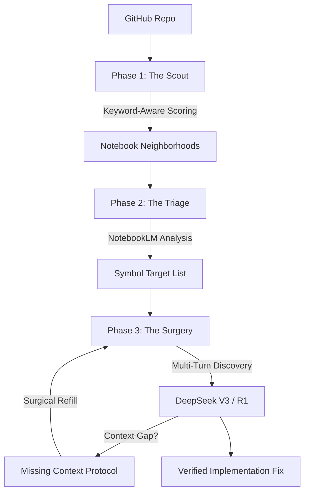

# RepoOrbit: The Systems-Level Developer Exoskeleton

RepoOrbit is a **High-Precision AI Orchestration Pipeline** designed for senior engineers auditing massive, performance-critical codebases (e.g., PostgreSQL, Go Runtime). It solves the "Context Limit" problem through surgical structural mapping and a deterministic multi-turn discovery loop.

---

## 📐 The Engine Architecture


```mermaid
graph TD
    A[GitHub Repo] --> B[Phase 1: The Scout]
    B -->|Keyword-Aware Scoring| C[Notebook Neighborhoods]
    C --> D[Phase 2: The Triage]
    D -->|NotebookLM Analysis| E[Symbol Target List]
    E --> F[Phase 3: The Surgery]
    F -->|Multi-Turn Discovery| G[DeepSeek V3 / R1]
    G -->|Context Gap?| H[Missing Context Protocol]
    H -->|Surgical Refill| F
    G --> I[Verified Implementation Fix]
```

---

## ⚙️ The High-Precision Discovery Loop

1.  **🔭 The Scout (Scoring)**: Maps the repository into "Notebook Neighborhoods" and performs keyword-aware relevance scoring. For C/Go repositories, it uses a **Directory Co-location Bonus** to ensure functionally related files (e.g., `src/backend/utils/adt/`) are bundled together for the AI.

2.  **⚖️ The Triage (Planning)**: Leverages **NotebookLM** to analyze the scored neighborhoods and translate natural language queries into a concrete **Symbol Target List** (e.g., "Find the underflow in array_seek").

3.  **🔪 The Surgery (Implementation)**: Feeds surgical code blocks to **DeepSeek**. Unlike generic LLM calls, this phase uses:
    - **Missing Context Protocol**: DeepSeek can respond with `NEED_MORE_CONTEXT` in a structured JSON format to trigger automated multi-turn discovery.
    - **Query-Aware Symbols**: `symbols.txt` is dynamically filtered to include only the ~500 entries most relevant to the current surgery, maximizing signal-to-noise ratio.
    - **Regex-Based Extraction**: Robust support for C, Go, Rust, and C++ via balanced-brace counting to isolate functions without expensive AST parsing.

---

## 🚀 Key Breakthroughs

- **🏗️ Context-Window Efficiency**: By stripping thousands of lines of metadata noise (removed `graph.json`, filtered `symbols.txt`), RepoOrbit achieves up to **90% reduction** in context-window bloat for large repositories.
- **👑 C/Go/Systems Authority**: Specialized regex extractors isolate function bodies even when Babel/AST parsers fail on systems-level code.
- **🔄 Multi-Turn Discovery**: An automated loop that fetches missing dependencies while maintaining the original session context, preventing "logic drift" during complex bug fixes.
- **🌉 Playwright Orchestration**: Automates the ingestion of "Expert Context" via Playwright's CDP integration, enabling seamless interactions with proprietary LLM interfaces.

---

## 🛠️ Tech Stack

- **Automation**: Playwright (CDP-based Browser Orchestration)
- **Framework**: Next.js 16 (App Router)
- **Engine**: Symbol-Aware Extraction + Directory-Scoped Discovery
- **LLM Pipeline**: 
    - **DeepSeek V3/R1**: Primary reasoning engine for implementation and logic auditing.
    - **NotebookLM**: Expert architectural triage and planning.
- **Styling**: Tailwind CSS v4 (Glassmorphism Engineering Aesthetics)

---

## 🏁 Quick Start

```bash
git clone https://github.com/jaadu/repoorbit
npm install
npm run dev
```

**Environment Variables (.env)**:
- `GITHUB_TOKEN`
- `DEEPSEEK_API_KEY`

---
*Built for engineers who need to see through the noise.*
