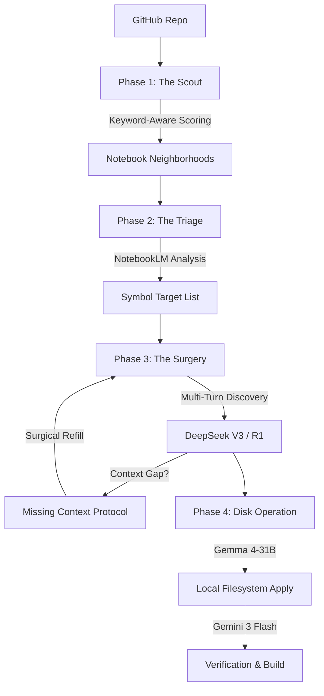

# RepoOrbit: The Systems-Level Developer Exoskeleton

RepoOrbit is a **High-Precision AI Orchestration Pipeline** designed for senior engineers auditing massive, performance-critical codebases. It solves the "Context Limit" problem through surgical structural mapping, a deterministic multi-turn discovery loop, and a specialized disk-level operator engine.

---

## 📐 The Engine Architecture


```mermaid
graph TD
    A[GitHub Repo] --> B[Phase 1: The Scout]
    B -->|Keyword-Aware Scoring| C[Notebook Neighborhoods]
    C --> D[Phase 2: The Triage]
    D -->|NotebookLM Analysis| E[Symbol Target List]
    E --> F[Phase 3: The Surgery]
    F -->|Multi-Turn Discovery| G[DeepSeek V3 / R1]
    G -->|Context Gap?| H[Missing Context Protocol]
    H -->|Surgical Refill| F
    G --> I[Phase 4: Disk Operation]
    I -->|Gemma 4-31B| J[Local Filesystem Apply]
    J -->|Gemini 3 Flash| K[Verification & Build]
```

---

## ⚙️ The Orchestration Pipeline

1.  **🔭 The Scout (Scoring)**: Maps the repository into "Notebook Neighborhoods" and performs keyword-aware relevance scoring.
2.  **⚖️ The Triage (Planning)**: Leverages **NotebookLM** to translate natural language queries into a concrete **Symbol Target List**.
3.  **🔪 The Surgery (Implementation)**: Feeds surgical code blocks to **DeepSeek** via the **Missing Context Protocol** to resolve dependencies dynamically.
4.  **💾 The Operator (Disk Engine)**: Uses **Gemma 4-31B** as a strictly constrained disk-level operator to apply changes and run local tests/builds.
5.  **✅ The Verifier (Flash)**: Uses **Gemini 3 Flash** to review execution reports and handle final architectural edge cases.

---

## 📁 Library Structure

The codebase is organized into domain-driven modules for maximum maintainability:

- **`lib/automation/`**: Specialist agent adapters (ChatGPT, DeepSeek, Gemini, OpenCode).
- **`lib/builders/`**: Context assembly and prompt generation engines.
- **`lib/core/`**: Fundamental types, browser management, and GitHub API integration.
- **`lib/prompts/`**: Modular prompt engineering layer (Coding, Review, Synthesis, Disk).

---

## 🚀 Key Breakthroughs

- **🏗️ Context-Window Efficiency**: Significant reduction in noise via surgical mapping and removal of metadata bloat.
- **👑 Multi-Agent Loop**: A robust iteration cycle where coders and reviewers collaborate to produce production-ready fixes.
- **🔄 Stall Detection**: Automated watchdog timers in the automation loop to detect and recover from silent generator hangs.
- **🌉 Orchestration Dashboard**: A custom industrial-grade CLI dashboard providing real-time status of the OpenCode cores and Next.js dev server.

---

## 🛠️ Tech Stack

- **Automation**: Playwright (Persistent Chromium Context)
- **Framework**: Next.js 16 (Turbopack)
- **Cores**:
  - **OpenCode**: Gemma 4-31B (Disk Operator) & Gemini 3 Flash (Verifier).
  - **DeepSeek V3/R1**: Primary reasoning and implementation.
- **Styling**: Vanilla CSS (Industrial Blue & Green Aesthetics).

---

## 🏁 Quick Start

```bash
git clone https://github.com/jaadu/repoorbit
npm install
npm run dev
```

> **Tip**: Use `npm run dev -s` for a silent, clean dashboard startup.

**Environment Variables (.env)**:

- `GITHUB_TOKEN`
- `DEEPSEEK_API_KEY`
- `NEXT_PUBLIC_GITHUB_TOKEN`

---

_Built for engineers who need to see through the noise._
