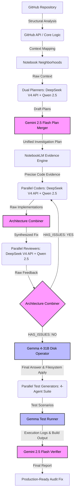

# RepoOrbit

## Industrial-Grade AI Orchestration for Massive Codebases

RepoOrbit is a high-precision orchestration pipeline designed for generic codebase inquiries, surgical bug hunting, and automated fixing. It bypasses context-window limitations through structural mapping and deterministic multi-model loops, with upcoming support for automated workflow graph generation.

---

## Architecture & Data Flow

The following diagram illustrates the multi-model orchestration path, from initial repository ingestion to final verified disk application.


```mermaid
graph TD
    A[ GitHub Repository ] -->| Structural Analysis | B( GitHub API / Core Logic )
    B -->| Context Mapping | C[ Notebook Neighborhoods ]
    
    C -->| Raw Context | D( Dual Planners: DeepSeek V4 API + Qwen 2.5 )
    D -->| Draft Plans | E[ Gemini 2.5 Flash Plan Merger ]
    E -->| Unified Investigation Plan | F[ NotebookLM Evidence Engine ]
    
    F -->| Precise Code Evidence | G( Parallel Coders: DeepSeek V4 API + Qwen 2.5 )
    G -->| Raw Implementations | H[ Architecture Combiner ]
    
    H -->| Synthesized Fix | I( Parallel Reviewers: DeepSeek V4 API + Qwen 2.5 )
    I -->| Raw Feedback | J{ Architecture Combiner }
    
    J -->| HAS_ISSUES: YES | G
    J -->| HAS_ISSUES: NO | K[ Gemma 4-31B Disk Operator ]
    
    K -->| Final Answer & Filesystem Apply | L( Parallel Test Generators: 4-Agent Suite )
    L -->| Test Scenarios | M[ Gemma Test Runner ]
    
    M -->| Execution Logs & Build Output | N[ Gemini 2.5 Flash Verifier ]
    N -->| Final Report | O[ Production-Ready Audit Fix ]

    style E fill:#f9f,stroke:#333,stroke-width:2px,color:#000
    style H fill:#f9f,stroke:#333,stroke-width:2px,color:#000
    style J fill:#f9f,stroke:#333,stroke-width:2px,color:#000
    style N fill:#f9f,stroke:#333,stroke-width:2px,color:#000
    style K fill:#bbf,stroke:#333,stroke-width:2px,color:#000
    style M fill:#bbf,stroke:#333,stroke-width:2px,color:#000
```

---

## Core Pipeline

| Phase | Responsibility | Model Stack |
| :--- | :--- | :--- |
| **Scout** | Structural analysis and relevance scoring of neighborhoods. | GitHub API / Core Logic |
| **Triage** | Dual-model strategy generation and merging. | DeepSeek / Qwen + Gemini Flash |
| **Evidence** | Extracting precise code evidence from mapped notebooks. | NotebookLM |
| **Surgery** | Implementation loop with parallel coders and architectural combination. | DeepSeek R1 / Qwen 2.5 |
| **Testing** | 4-agent parallel test scenario generation and local execution. | DeepSeek / Qwen + Gemma |
| **Operator** | Constrained filesystem application and test execution. | Gemma 4-31B |
| **Verifier** | Architectural review and validation of execution logs. | Gemini 2.5 Flash |

---

## Technical Specifications

* **Automation Engine**: Persistent Playwright context utilizing Brave.
* **Frontend**: Next.js 16 with Turbopack for high-performance dashboarding.
* **Orchestration**: Custom dashboard providing real-time status of local cores and server state.
* **Stability**: Integrated stall detection with automated watchdog timers and UI-level recovery.
* **OpenCode Integration**: Automated UI-level tuning for high-power execution and planning modes.

---

## Library Architecture

The codebase follows a domain-driven structure to ensure modularity and ease of maintenance:

* `lib/automation/`: Adapters for DeepSeek, Qwen, Gemini, and OpenCode.
* `lib/builders/`: Context assembly and dynamic prompt engineering.
* `lib/core/`: Browser management, GitHub integration, and fundamental types.
* `lib/prompts/`: Modular system instructions for specialized agent tasks.

---

## Quick Start

### 1. Dependencies

Install the OpenCode local engine globally:

```bash
npm install -g @google/opencode
```

Configure your Google AI API key from [AI Studio](https://aistudio.google.com/):

```bash
opencode config set GOOGLE_API_KEY=<your_key>
```

### 2. Installation

```bash
git clone https://github.com/jaadu/repoorbit
cd repoorbit
npm install
```

### 3. Environment Configuration

Create a `.env` file in the root directory:

```env
GITHUB_TOKEN=<your_github_pat>
NEXT_PUBLIC_GITHUB_TOKEN=<your_github_pat>
```

### 4. Launch

Execute the full orchestration stack:

```bash
./start.sh
```

---

**Note**: RepoOrbit utilizes browser-based automation for Qwen to minimize API costs and maximize reasoning capabilities. DeepSeek is powered by the NVIDIA API for high-performance inference. Ensure you have `NVIDIA_API_KEY` set in your environment.

_Engineered for high-fidelity codebase surgery._
