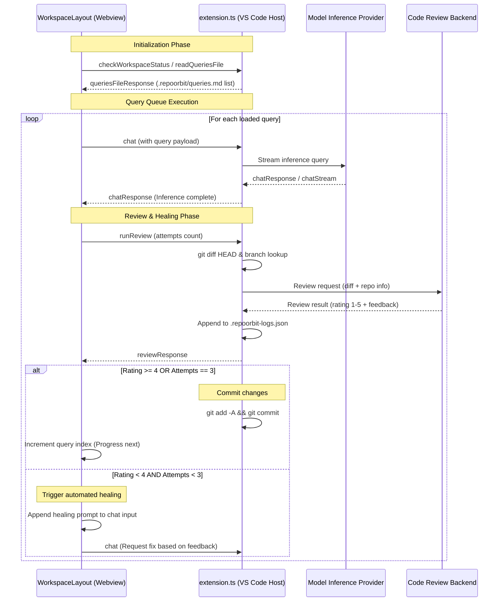

# <p align="center"><br>RepoOrbit</p>

<p align="center">
  <strong>Run automated, self-healing query pipelines and review diffs inside your local workspace.</strong>
</p>

---

RepoOrbit is a VS Code Extension and React Webview-based orchestration interface designed for running automated, self-healing query pipelines directly against local workspaces. It integrates code execution channels with automated, closed-loop git diff reviews powered by a configurable code review backend.

---

## 🚀 Key Features

*   **Activity Bar Integration** - Fully consolidated sidebar panel for a distraction-free, space-efficient interface.
*   **Self-Healing Loop** - Listens to query outputs, evaluates rating thresholds, and generates iterative repair prompts automatically.
*   **Persistent Sessions** - Retains active chat history, queue execution indexes, and model selections across panel toggles and window reloads.
*   **Code Review Pipeline** - Captures raw uncommitted diffs (`git diff HEAD`), queries a configurable evaluator backend, and commits changes when thresholds are reached.
*   **Model Selector** - Custom vendor selector displaying Gemini, Claude, and GPT models along with dynamically updated quota progress bars.

---

## 🏗️ Architectural Components

The repository is organized into a clean client-host model:

```
repoorbit/
├── src/
│   ├── components/
│   │   └── WorkspaceLayout.tsx   # Consolidated React Webview Viewport
│   ├── lib/core/
│   │   ├── constants/            # Master rules, fallback workflows, default queries
│   │   ├── github.ts             # GitHub repository input parser
│   │   ├── prompt.ts             # Core system instructions and prompts
│   │   ├── store.ts              # Zustand selection store
│   │   └── types.ts              # Core type definitions
│   ├── styles/globals.css        # Glassmorphic visual theme definitions
│   ├── extension.ts              # VS Code Extension Host (git, review, and file operations)
│   └── main.tsx                  # Webview entrypoint
├── tsconfig.json                 # TypeScript compiler configuration
└── vite.config.ts                # Webview build and bundling configuration
```

### 1. VS Code Extension Host (`src/extension.ts`)
Serves as the host layer, executing privileged operations on the local file system and git:
*   **Workspace Discovery**: Periodically audits running processes to detect and bind to the local Language Server.
*   **Repository Management**: Handles git clone commands and directory bootstrapping.
*   **Query File Subscriptions**: Monitors and reads `.repoorbit/queries.md` to stream queue steps to the webview UI.
*   **Persistent Session Store**: Retains session states (`messages`, queue execution indexes, model configurations, and runtime loading status) in the persistent extension host memory. This ensures background chat streaming operations are unaffected by panel closings or reloads.
*   **Code Review Pipeline**:
    *   Dynamically extracts the active git branch name and executes `git diff HEAD` to capture uncommitted changes.
    *   Sends the diff payload, repository coordinates, and target branch to a pluggable review backend.
    *   Handles secure global key storage and secure native password inputs (`vscode.window.showInputBox`).
    *   Performs git commits automatically for ratings >= 4/5 or when maximum retry thresholds are reached.
    *   Writes execution logs directly to `.repoorbit-logs.json`.

### 2. Consolidated Webview Viewport (`src/components/WorkspaceLayout.tsx`)
A dark-mode, layout compiling all visual panels, chat flows, and model controls:
*   **State Rehydration**: Automatically requests the cached session state from the host on component mount, preventing UI wipeouts during panel toggle operations.
*   **Model Selector**: Custom dropdown showcasing vendor engines alongside active quota meters.
*   **Pipeline Timeline**: A horizontal scrolling visualizer representing loaded, completed, active, and pending query states.
*   **Self-Healing Loop Controller**: Listens to query outputs, evaluates rating thresholds from the review payload, and generates iterative repair prompts automatically.
*   **Markdown Renderer**: Embeds React-Markdown with GitHub Flavored Markdown (GFM) and inline code block wrappers.

---

## 🔄 Execution and Self-Healing Data Flow

The sequence diagram below describes the cycle from query loading to validation, review, and repository commit:


```mermaid
sequenceDiagram
    participant UI as WorkspaceLayout (Webview)
    participant Host as extension.ts (VS Code Host)
    participant LLM as Model Inference Provider
    participant Reviewer as Code Review Backend

    Note over UI,Host: Initialization Phase
    UI->>Host: checkWorkspaceStatus / readQueriesFile
    Host-->>UI: queriesFileResponse (.repoorbit/queries.md list)
    
    Note over UI,Host: Query Queue Execution
    loop For each loaded query
        UI->>Host: chat (with query payload)
        Host->>LLM: Stream inference query
        LLM-->>Host: chatResponse / chatStream
        Host-->>UI: chatResponse (Inference complete)
        
        Note over UI,Host: Review & Healing Phase
        UI->>Host: runReview (attempts count)
        Host->>Host: git diff HEAD & branch lookup
        Host->>Reviewer: Review request (diff + repo info)
        Reviewer-->>Host: Review result (rating 1-5 + feedback)
        Host->>Host: Append to .repoorbit-logs.json
        Host-->>UI: reviewResponse
        
        alt Rating >= 4 OR Attempts == 3
            Note over Host: Commit changes
            Host->>Host: git add -A && git commit
            UI->>UI: Increment query index (Progress next)
        else Rating < 4 AND Attempts < 3
            Note over UI: Trigger automated healing
            UI->>UI: Append healing prompt to chat input
            UI->>Host: chat (Request fix based on feedback)
        end
    end
```

---

## 🛠️ Development and Build Scripts

### 1. Verification and Compilation
Verify static typing compliance before compiling:
```bash
npx tsc --noEmit
```

### 2. Bundling and Packaging
Compile the full extension host bundle and build the webview production bundles:
```bash
npm run ext:package
```
This script executes two sub-commands:
*   `ext:build-ui`: Uses Vite to transpile React components and output bundled assets inside `dist-webview/`.
*   `ext:build-host`: Uses esbuild to package the extension host into a single Node-compatible bundle at `dist-extension/extension_v4_final.js`.

---

## 📦 Publishing the Extension

To generate the `.vsix` installer package:
```bash
npx @vscode/vsce package
```
This produces `repoorbit-0.1.0.vsix` in your root folder. You can upload this package directly via the [VS Code Marketplace Portal](https://marketplace.visualstudio.com/manage) under publisher ID `JAADU611`.
