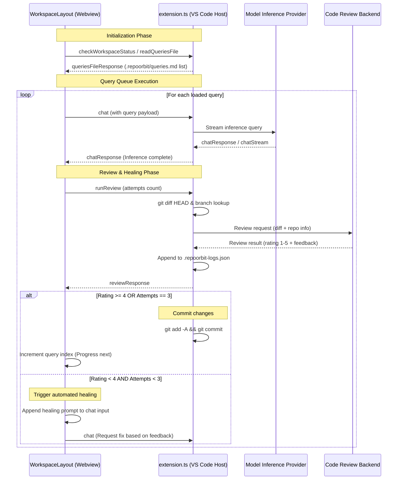

# RepoOrbit

RepoOrbit is a VS Code Extension and React Webview-based orchestration interface designed for running automated, self-healing query pipelines directly against local workspaces. It integrates code execution channels with automated, closed-loop git diff reviews powered by a configurable code review backend.

---

## Key Features

* **Activity Bar Integration** - Fully consolidated sidebar panel for a distraction-free, space-efficient interface.
* **Self-Healing Loop** - Listens to query outputs, evaluates rating thresholds, and generates iterative repair prompts automatically.
* **Persistent Sessions** - Retains active chat history, queue execution indexes, and model selections across panel toggles and window reloads.
* **Code Review Pipeline** - Captures raw uncommitted diffs (`git diff HEAD`), queries a configurable evaluator backend, and commits changes when thresholds are reached.
* **Model Selector** - Custom vendor selector displaying Gemini, Claude, and GPT models along with dynamically updated quota progress bars.

---

## Architectural Components

The extension is organized into a clean client-host model:

* **VS Code Extension Host** - Serves as the host layer executing privileged operations on the local file system and git, including workspace discovery, repository management, query file subscriptions, and code review management.
* **Consolidated Webview Viewport** - A React Webview viewport rendering visual panels, chat flows, timeline visualizer, and model controls.

---

## Execution and Self-Healing Data Flow

The flow below describes the cycle from query loading to validation, review, and repository commit:

```mermaid
sequenceDiagram
    participant UI as WorkspaceLayout (Webview)
    participant Host as extension.ts (VS Code Host)
    participant LLM as Model Inference Provider
    participant Reviewer as Code Review Backend

    Note over UI,Host: Initialization Phase
    UI->>Host: checkWorkspaceStatus / readQueriesFile
    Host-->>UI: queriesFileResponse (.repoorbit/queries.md list)
    
    Note over UI,Host: Query Queue Execution
    loop For each loaded query
        UI->>Host: chat (with query payload)
        Host->>LLM: Stream inference query
        LLM-->>Host: chatResponse / chatStream
        Host-->>UI: chatResponse (Inference complete)
        
        Note over UI,Host: Review & Healing Phase
        UI->>Host: runReview (attempts count)
        Host->>Host: git diff HEAD & branch lookup
        Host->>Reviewer: Review request (diff + repo info)
        Reviewer-->>Host: Review result (rating 1-5 + feedback)
        Host->>Host: Append to .repoorbit-logs.json
        Host-->>UI: reviewResponse
        
        alt Rating >= 4 OR Attempts == 3
            Note over Host: Commit changes
            Host->>Host: git add -A && git commit
            UI->>UI: Increment query index (Progress next)
        else Rating < 4 AND Attempts < 3
            Note over UI: Trigger automated healing
            UI->>UI: Append healing prompt to chat input
            UI->>Host: chat (Request fix based on feedback)
        end
    end
```
